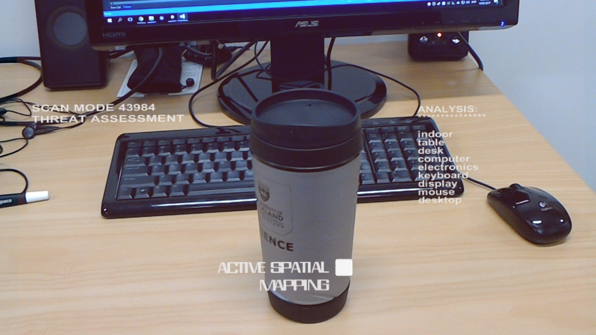

# Terminator Vision

This is a hololens application that uses the [Microsoft Computer Vision API](https://www.microsoft.com/cognitive-services/en-us/computer-vision-api) and overlays the result in a style similar to the movie Terminator. It can detect objects, faces, and OCR text.  

See the Windows Blog [post](https://blogs.windows.com/buildingapps/2017/03/06/building-terminator-vision-hud-hololens/) for more information  

*Some setup instructions*

(When you open the project in Unity the first time, you are probably going to see errors like HoloToolkit cannot be found or File type unknown. Here's how you're going to fix that.)

1. Import the [HoloToolkit](https://github.com/Microsoft/HoloToolkit-Unity) package into your project

2. Open the Build Settings dialog (File | Build Settings)

3. Click on Add Open Scenes to add the *main* scene to your build

4. Use the following Build Settings options: 
	
	* Platform = Windows Store
	* SDK = Universal 10
	* Target = Any device
	* UWP Build Type = D3D
	* Copy References = true

5. Now we need to turn on some capabilities in order to allow the REST calls and photo capture to work. Press "Player Settings...". In the inspector, on the Microsoft Store tab, expand out the Publishing Settings. In the capabilities section turn on the following:

       * InternetClient
       * InternetClientServer
       * WebCam 

6. Create a *WindowsStoreApp* folder in your project root directory and Build to it

7. Errors should be gone now, but if they aren't just shut down and re-open your Unity project

8. [Sign up](https://www.microsoft.com/cognitive-services) for a  Cognitive Services account and generate a subscription key for the Computer Vision API

9. Copy your guid key into the Scripts/Hud.cs script where you see the following code:

    string _subscriptionKey = "< Computer Vision Key goes here !!!>";

	

